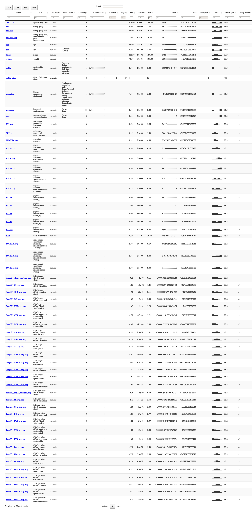

Codebook - The Dark Triad and attractiveness in speed dating
================

-   [Metadata](#metadata)
-   [Variables](#variables)
    -   [SD\_Code](#SD_Code)
    -   [DG](#DG)
    -   [DG\_size](#DG_size)
    -   [DG\_size\_acq](#DG_size_acq)
    -   [age](#age)
    -   [sex](#sex)
    -   [height](#height)
    -   [weight](#weight)
    -   [relStat](#relStat)
    -   [relStat\_other](#relStat_other)
    -   [education](#education)
    -   [contracept](#contracept)
    -   [date](#date)
    -   [NPI\_avg](#NPI_avg)
    -   [SRP\_avg](#SRP_avg)
    -   [MACHIV\_avg](#MACHIV_avg)
    -   [BFI\_N\_avg](#BFI_N_avg)
    -   [BFI\_E\_avg](#BFI_E_avg)
    -   [BFI\_O\_avg](#BFI_O_avg)
    -   [BFI\_A\_avg](#BFI_A_avg)
    -   [BFI\_C\_avg](#BFI_C_avg)
    -   [PA\_R1](#PA_R1)
    -   [PA\_R2](#PA_R2)
    -   [PA\_R3](#PA_R3)
    -   [PA\_R4](#PA_R4)
    -   [PA\_avg](#PA_avg)
    -   [BMI](#BMI)
    -   [SOI\_R\_B\_avg](#SOI_R_B_avg)
    -   [SOI\_R\_A\_avg](#SOI_R_A_avg)
    -   [SOI\_R\_D\_avg](#SOI_R_D_avg)
    -   [TargEff\_\_choice\_relFrequ\_acq
        {\#TargEff\_\_choice\_relFrequ\_acq
        .tabset}](#targeff__choice_relfrequ_acq-targeff__choice_relfrequ_acq-tabset)
    -   [TargEff\_\_FS\_avg\_acq {\#TargEff\_\_FS\_avg\_acq
        .tabset}](#targeff__fs_avg_acq-targeff__fs_avg_acq-tabset)
    -   [TargEff\_\_ONS\_avg\_acq {\#TargEff\_\_ONS\_avg\_acq
        .tabset}](#targeff__ons_avg_acq-targeff__ons_avg_acq-tabset)
    -   [TargEff\_\_BC\_avg\_acq {\#TargEff\_\_BC\_avg\_acq
        .tabset}](#targeff__bc_avg_acq-targeff__bc_avg_acq-tabset)
    -   [TargEff\_\_FWB\_avg\_acq {\#TargEff\_\_FWB\_avg\_acq
        .tabset}](#targeff__fwb_avg_acq-targeff__fwb_avg_acq-tabset)
    -   [TargEff\_\_STR\_avg\_acq {\#TargEff\_\_STR\_avg\_acq
        .tabset}](#targeff__str_avg_acq-targeff__str_avg_acq-tabset)
    -   [TargEff\_\_LTR\_avg\_acq {\#TargEff\_\_LTR\_avg\_acq
        .tabset}](#targeff__ltr_avg_acq-targeff__ltr_avg_acq-tabset)
    -   [TargEff\_\_PA\_avg\_acq {\#TargEff\_\_PA\_avg\_acq
        .tabset}](#targeff__pa_avg_acq-targeff__pa_avg_acq-tabset)
    -   [TargEff\_\_Like\_avg\_acq {\#TargEff\_\_Like\_avg\_acq
        .tabset}](#targeff__like_avg_acq-targeff__like_avg_acq-tabset)
    -   [TargEff\_\_Int\_avg\_acq {\#TargEff\_\_Int\_avg\_acq
        .tabset}](#targeff__int_avg_acq-targeff__int_avg_acq-tabset)
    -   [TargEff\_\_FIPI\_N\_avg\_acq {\#TargEff\_\_FIPI\_N\_avg\_acq
        .tabset}](#targeff__fipi_n_avg_acq-targeff__fipi_n_avg_acq-tabset)
    -   [TargEff\_\_FIPI\_E\_avg\_acq {\#TargEff\_\_FIPI\_E\_avg\_acq
        .tabset}](#targeff__fipi_e_avg_acq-targeff__fipi_e_avg_acq-tabset)
    -   [TargEff\_\_FIPI\_O\_avg\_acq {\#TargEff\_\_FIPI\_O\_avg\_acq
        .tabset}](#targeff__fipi_o_avg_acq-targeff__fipi_o_avg_acq-tabset)
    -   [TargEff\_\_FIPI\_A\_avg\_acq {\#TargEff\_\_FIPI\_A\_avg\_acq
        .tabset}](#targeff__fipi_a_avg_acq-targeff__fipi_a_avg_acq-tabset)
    -   [TargEff\_\_FIPI\_C\_avg\_acq {\#TargEff\_\_FIPI\_C\_avg\_acq
        .tabset}](#targeff__fipi_c_avg_acq-targeff__fipi_c_avg_acq-tabset)
    -   [PercEff\_\_choice\_relFrequ\_acq
        {\#PercEff\_\_choice\_relFrequ\_acq
        .tabset}](#perceff__choice_relfrequ_acq-perceff__choice_relfrequ_acq-tabset)
    -   [PercEff\_\_FS\_avg\_acq {\#PercEff\_\_FS\_avg\_acq
        .tabset}](#perceff__fs_avg_acq-perceff__fs_avg_acq-tabset)
    -   [PercEff\_\_ONS\_avg\_acq {\#PercEff\_\_ONS\_avg\_acq
        .tabset}](#perceff__ons_avg_acq-perceff__ons_avg_acq-tabset)
    -   [PercEff\_\_BC\_avg\_acq {\#PercEff\_\_BC\_avg\_acq
        .tabset}](#perceff__bc_avg_acq-perceff__bc_avg_acq-tabset)
    -   [PercEff\_\_FWB\_avg\_acq {\#PercEff\_\_FWB\_avg\_acq
        .tabset}](#perceff__fwb_avg_acq-perceff__fwb_avg_acq-tabset)
    -   [PercEff\_\_STR\_avg\_acq {\#PercEff\_\_STR\_avg\_acq
        .tabset}](#perceff__str_avg_acq-perceff__str_avg_acq-tabset)
    -   [PercEff\_\_LTR\_avg\_acq {\#PercEff\_\_LTR\_avg\_acq
        .tabset}](#perceff__ltr_avg_acq-perceff__ltr_avg_acq-tabset)
    -   [PercEff\_\_PA\_avg\_acq {\#PercEff\_\_PA\_avg\_acq
        .tabset}](#perceff__pa_avg_acq-perceff__pa_avg_acq-tabset)
    -   [PercEff\_\_Like\_avg\_acq {\#PercEff\_\_Like\_avg\_acq
        .tabset}](#perceff__like_avg_acq-perceff__like_avg_acq-tabset)
    -   [PercEff\_\_Int\_avg\_acq {\#PercEff\_\_Int\_avg\_acq
        .tabset}](#perceff__int_avg_acq-perceff__int_avg_acq-tabset)
    -   [PercEff\_\_FIPI\_N\_avg\_acq {\#PercEff\_\_FIPI\_N\_avg\_acq
        .tabset}](#perceff__fipi_n_avg_acq-perceff__fipi_n_avg_acq-tabset)
    -   [PercEff\_\_FIPI\_E\_avg\_acq {\#PercEff\_\_FIPI\_E\_avg\_acq
        .tabset}](#perceff__fipi_e_avg_acq-perceff__fipi_e_avg_acq-tabset)
    -   [PercEff\_\_FIPI\_O\_avg\_acq {\#PercEff\_\_FIPI\_O\_avg\_acq
        .tabset}](#perceff__fipi_o_avg_acq-perceff__fipi_o_avg_acq-tabset)
    -   [PercEff\_\_FIPI\_A\_avg\_acq {\#PercEff\_\_FIPI\_A\_avg\_acq
        .tabset}](#perceff__fipi_a_avg_acq-perceff__fipi_a_avg_acq-tabset)
    -   [PercEff\_\_FIPI\_C\_avg\_acq {\#PercEff\_\_FIPI\_C\_avg\_acq
        .tabset}](#perceff__fipi_c_avg_acq-perceff__fipi_c_avg_acq-tabset)
-   [Missingness report](#missingness-report)
-   [Codebook table](#codebook-table)

Here, we’re just setting a few options.

``` r
knitr::opts_chunk$set(
  warning = TRUE, # show warnings during codebook generation
  message = TRUE, # show messages during codebook generation
  error = TRUE, # do not interrupt codebook generation in case of errors,
                # usually better for debugging
  echo = TRUE  # show R code
)
ggplot2::theme_set(ggplot2::theme_bw())
```

Now, we’re preparing our data for the codebook.

``` r
library(codebook)
codebook_data <- codebook::bfi
# to import an SPSS file from the same folder uncomment and edit the line below
# codebook_data <- rio::import("mydata.sav")
# for Stata
# codebook_data <- rio::import("mydata.dta")
# for CSV
# codebook_data <- rio::import("mydata.csv")

# omit the following lines, if your missing values are already properly labelled
codebook_data <- detect_missing(codebook_data,
    only_labelled = TRUE, # only labelled values are autodetected as
                                   # missing
    negative_values_are_missing = FALSE, # negative values are missing values
    ninety_nine_problems = TRUE,   # 99/999 are missing values, if they
                                   # are more than 5 MAD from the median
    )

# If you are not using formr, the codebook package needs to guess which items
# form a scale. The following line finds item aggregates with names like this:
# scale = scale_1 + scale_2R + scale_3R
# identifying these aggregates allows the codebook function to
# automatically compute reliabilities.
# However, it will not reverse items automatically.
codebook_data <- detect_scales(codebook_data)
```

    ## 4 BFIK_open items connected to scale

    ## 4 BFIK_agree items connected to scale

    ## 4 BFIK_extra items connected to scale

    ## 3 BFIK_neuro items connected to scale

    ## 4 BFIK_consc items connected to scale

Create codebook

``` r
# source: https://osf.io/jvk3u/
df <- rio::import("DarkTriadDate_person.sav")

# create codebook
codebook::codebook(df)
```

### Metadata

#### Description

**Dataset name**: df

The dataset has N=90 rows and 60 columns. 45 rows have no missing values
on any column.

<details>
<summary title="Expand this section to see some additional metadata in a structured format that is useful for search engines">
Metadata for search engines
</summary>

-   **Date published**: 2021-03-03

<table class="kable_wrapper">
<tbody>
<tr>
<td>

| x                                |
|:---------------------------------|
| SD\_Code                         |
| DG                               |
| DG\_size                         |
| DG\_size\_acq                    |
| age                              |
| sex                              |
| height                           |
| weight                           |
| relStat                          |
| relStat\_other                   |
| education                        |
| contracept                       |
| date                             |
| NPI\_avg                         |
| SRP\_avg                         |
| MACHIV\_avg                      |
| BFI\_N\_avg                      |
| BFI\_E\_avg                      |
| BFI\_O\_avg                      |
| BFI\_A\_avg                      |
| BFI\_C\_avg                      |
| PA\_R1                           |
| PA\_R2                           |
| PA\_R3                           |
| PA\_R4                           |
| PA\_avg                          |
| BMI                              |
| SOI\_R\_B\_avg                   |
| SOI\_R\_A\_avg                   |
| SOI\_R\_D\_avg                   |
| TargEff\_\_choice\_relFrequ\_acq |
| TargEff\_\_FS\_avg\_acq          |
| TargEff\_\_ONS\_avg\_acq         |
| TargEff\_\_BC\_avg\_acq          |
| TargEff\_\_FWB\_avg\_acq         |
| TargEff\_\_STR\_avg\_acq         |
| TargEff\_\_LTR\_avg\_acq         |
| TargEff\_\_PA\_avg\_acq          |
| TargEff\_\_Like\_avg\_acq        |
| TargEff\_\_Int\_avg\_acq         |
| TargEff\_\_FIPI\_N\_avg\_acq     |
| TargEff\_\_FIPI\_E\_avg\_acq     |
| TargEff\_\_FIPI\_O\_avg\_acq     |
| TargEff\_\_FIPI\_A\_avg\_acq     |
| TargEff\_\_FIPI\_C\_avg\_acq     |
| PercEff\_\_choice\_relFrequ\_acq |
| PercEff\_\_FS\_avg\_acq          |
| PercEff\_\_ONS\_avg\_acq         |
| PercEff\_\_BC\_avg\_acq          |
| PercEff\_\_FWB\_avg\_acq         |
| PercEff\_\_STR\_avg\_acq         |
| PercEff\_\_LTR\_avg\_acq         |
| PercEff\_\_PA\_avg\_acq          |
| PercEff\_\_Like\_avg\_acq        |
| PercEff\_\_Int\_avg\_acq         |
| PercEff\_\_FIPI\_N\_avg\_acq     |
| PercEff\_\_FIPI\_E\_avg\_acq     |
| PercEff\_\_FIPI\_O\_avg\_acq     |
| PercEff\_\_FIPI\_A\_avg\_acq     |
| PercEff\_\_FIPI\_C\_avg\_acq     |

</td>
</tr>
</tbody>
</table>
</details>

## Variables

### SD\_Code

speed dating code

#### Distribution


0 missing values.

#### Summary statistics

| name     | label             | data\_type | n\_missing | complete\_rate | min | median | max |     mean |      sd | hist  | format.spss |
|:---------|:------------------|:-----------|-----------:|---------------:|:----|:-------|:----|---------:|--------:|:------|:------------|
| SD\_Code | speed dating code | numeric    |          0 |              1 | 101 | 146    | 246 | 172.6333 | 52.2639 | ▇▅▁▃▇ | F8.0        |

### DG

dating group

#### Distribution


0 missing values.

#### Summary statistics

| name | label        | data\_type | n\_missing | complete\_rate | min | median | max |     mean |        sd | hist  | format.spss |
|:-----|:-------------|:-----------|-----------:|---------------:|:----|:-------|:----|---------:|----------:|:------|:------------|
| DG   | dating group | numeric    |          0 |              1 | 1   | 2      | 3   | 2.033333 | 0.7709618 | ▆▁▇▁▆ | F8.0        |

### DG\_size

dating group size

#### Distribution


0 missing values.

#### Summary statistics

| name     | label             | data\_type | n\_missing | complete\_rate | min | median | max |     mean |      sd | hist  | format.spss |
|:---------|:------------------|:-----------|-----------:|---------------:|:----|:-------|:----|---------:|--------:|:------|:------------|
| DG\_size | dating group size | numeric    |          0 |              1 | 11  | 15     | 19  | 15.35556 | 2.88861 | ▃▆▃▁▇ | F8.0        |

### DG\_size\_acq

dating group size, corrected for prior acquaintance

#### Distribution


0 missing values.

#### Summary statistics

| name          | label                                               | data\_type | n\_missing | complete\_rate | min | median | max |     mean |       sd | hist  | format.spss | display\_width |
|:--------------|:----------------------------------------------------|:-----------|-----------:|---------------:|:----|:-------|:----|---------:|---------:|:------|:------------|:---------------|
| DG\_size\_acq | dating group size, corrected for prior acquaintance | numeric    |          0 |              1 | 7   | 14     | 19  | 14.22222 | 2.936702 | ▁▆▇▆▇ | F8.0        | 11             |

### age

age

#### Distribution


0 missing values.

#### Summary statistics

| name | label | data\_type | n\_missing | complete\_rate | min | median | max |     mean |       sd | hist  | format.spss | display\_width |
|:-----|:------|:-----------|-----------:|---------------:|:----|:-------|:----|---------:|---------:|:------|:------------|:---------------|
| age  | age   | numeric    |          0 |              1 | 18  | 22     | 32  | 22.86667 | 3.094758 | ▅▇▅▂▁ | F3.0        | 5              |

### sex

sex

#### Distribution


0 missing values.

#### Summary statistics

| name | label | data\_type | n\_missing | complete\_rate | min | median | max |     mean |       sd | hist  | format.spss | display\_width |
|:-----|:------|:-----------|-----------:|---------------:|:----|:-------|:----|---------:|---------:|:------|:------------|:---------------|
| sex  | sex   | numeric    |          0 |              1 | 1   | 1      | 2   | 1.488889 | 0.502677 | ▇▁▁▁▇ | F1.0        | 5              |

#### Value labels

| name   | value |
|:-------|------:|
| female |     1 |
| male   |     2 |

Response choices

### height

height

#### Distribution


0 missing values.

#### Summary statistics

| name   | label  | data\_type | n\_missing | complete\_rate | min | median | max |     mean |      sd | hist  | format.spss | display\_width |
|:-------|:-------|:-----------|-----------:|---------------:|:----|:-------|:----|---------:|--------:|:------|:------------|:---------------|
| height | height | numeric    |          0 |              1 | 156 | 174    | 196 | 174.5444 | 9.26169 | ▃▇▇▃▃ | F3.0        | 5              |

### weight

weight

#### Distribution


0 missing values.

#### Summary statistics

| name   | label  | data\_type | n\_missing | complete\_rate | min | median | max |     mean |       sd | hist  | format.spss | display\_width |
|:-------|:-------|:-----------|-----------:|---------------:|:----|:-------|:----|---------:|---------:|:------|:------------|:---------------|
| weight | weight | numeric    |          0 |              1 | 46  | 70     | 106 | 68.91111 | 11.28452 | ▃▇▆▂▁ | F3.0        | 5              |

### relStat

relationship status

#### Distribution


1 missing values.

#### Summary statistics

| name    | label               | data\_type | n\_missing | complete\_rate | min | median | max |     mean |        sd | hist  | format.spss | display\_width |
|:--------|:--------------------|:-----------|-----------:|---------------:|:----|:-------|:----|---------:|----------:|:------|:------------|:---------------|
| relStat | relationship status | numeric    |          1 |      0.9888889 | 1   | 1      | 3   | 1.089888 | 0.3247534 | ▇▁▁▁▁ | F8.0        | 10             |

#### Value labels

| name                         | value |
|:-----------------------------|------:|
| single                       |     1 |
| in a relationship            |     2 |
| living separately / divorced |     3 |

Response choices

### relStat\_other

other relationship status

#### Distribution


0 missing values.

#### Summary statistics

| name           | label                     | data\_type | n\_missing | complete\_rate | n\_unique | empty | min | max | whitespace | format.spss | display\_width |
|:---------------|:--------------------------|:-----------|-----------:|---------------:|----------:|------:|:----|:----|-----------:|:------------|:---------------|
| relStat\_other | other relationship status | character  |          0 |              1 |         2 |    89 | 0   | 25  |          0 | A234        | 5              |

### education

highest educational attainment

#### Distribution


1 missing values.

#### Summary statistics

| name      | label                          | data\_type | n\_missing | complete\_rate | min | median | max |     mean |        sd | hist  | format.spss | display\_width |
|:----------|:-------------------------------|:-----------|-----------:|---------------:|:----|:-------|:----|---------:|----------:|:------|:------------|:---------------|
| education | highest educational attainment | numeric    |          1 |      0.9888889 | 4   | 4      | 5   | 4.168539 | 0.3764655 | ▇▁▁▁▂ | F1.0        | 5              |

#### Value labels

| name                        | value |
|:----------------------------|------:|
| nine years schooling only   |     1 |
| professional training       |     2 |
| vocational school           |     3 |
| university-entrance diploma |     4 |
| academic degree             |     5 |

Response choices

### contracept

hormonal contraception

#### Distribution


44 missing values.

#### Summary statistics

| name       | label                  | data\_type | n\_missing | complete\_rate | min | median | max |     mean |        sd | hist  | format.spss | display\_width |
|:-----------|:-----------------------|:-----------|-----------:|---------------:|:----|:-------|:----|---------:|----------:|:------|:------------|:---------------|
| contracept | hormonal contraception | numeric    |         44 |      0.5111111 | 1   | 2      | 2   | 1.652174 | 0.4815434 | ▅▁▁▁▇ | F1.0        | 5              |

#### Value labels

| name | value |
|:-----|------:|
| yes  |     1 |
| no   |     2 |

Response choices

### date

past experience with speed dating

#### Distribution


0 missing values.

#### Summary statistics

| name | label                             | data\_type | n\_missing | complete\_rate | min | median | max | mean |        sd | hist  | format.spss | display\_width |
|:-----|:----------------------------------|:-----------|-----------:|---------------:|:----|:-------|:----|-----:|----------:|:------|:------------|:---------------|
| date | past experience with speed dating | numeric    |          0 |              1 | 1   | 2      | 2   |  1.9 | 0.3016807 | ▁▁▁▁▇ | F1.0        | 5              |

#### Value labels

| name | value |
|:-----|------:|
| yes  |     1 |
| no   |     2 |

Response choices

### NPI\_avg

narcissistic personality inventory - average

#### Distribution


0 missing values.

#### Summary statistics

| name     | label                                        | data\_type | n\_missing | complete\_rate | min | median | max |     mean |        sd | hist  | format.spss | display\_width |
|:---------|:---------------------------------------------|:-----------|-----------:|---------------:|:----|:-------|:----|---------:|----------:|:------|:------------|:---------------|
| NPI\_avg | narcissistic personality inventory - average | numeric    |          0 |              1 | 1.7 | 2.6    | 3.6 | 2.611944 | 0.3468807 | ▁▅▇▂▁ | F8.2        | 10             |

### SRP\_avg

self-report psychopathy scale - average

#### Distribution


0 missing values.

#### Summary statistics

| name     | label                                   | data\_type | n\_missing | complete\_rate | min | median | max |     mean |        sd | hist  | format.spss | display\_width |
|:---------|:----------------------------------------|:-----------|-----------:|---------------:|:----|:-------|:----|---------:|----------:|:------|:------------|:---------------|
| SRP\_avg | self-report psychopathy scale - average | numeric    |          0 |              1 | 1.3 | 2.1    | 3.5 | 2.061539 | 0.3653243 | ▅▇▅▁▁ | F8.2        | 10             |

### MACHIV\_avg

mach-iv - average

#### Distribution


0 missing values.

#### Summary statistics

| name        | label             | data\_type | n\_missing | complete\_rate | min | median | max |     mean |        sd | hist  | format.spss | display\_width |
|:------------|:------------------|:-----------|-----------:|---------------:|:----|:-------|:----|---------:|----------:|:------|:------------|:---------------|
| MACHIV\_avg | mach-iv - average | numeric    |          0 |              1 | 1.4 | 2.7    | 4.8 | 2.749383 | 0.6652734 | ▂▇▆▂▁ | F8.2        | 12             |

### BFI\_N\_avg

big five inventory: neuroticism - average

#### Distribution


0 missing values.

#### Summary statistics

| name        | label                                     | data\_type | n\_missing | complete\_rate | min | median | max |     mean |       sd | hist  | format.spss | display\_width |
|:------------|:------------------------------------------|:-----------|-----------:|---------------:|:----|:-------|:----|---------:|---------:|:------|:------------|:---------------|
| BFI\_N\_avg | big five inventory: neuroticism - average | numeric    |          0 |              1 | 1   | 2.8    | 4.8 | 2.794444 | 0.934346 | ▅▆▇▅▂ | F8.2        | 11             |

### BFI\_E\_avg

big five inventory: extraversion - average

#### Distribution


0 missing values.

#### Summary statistics

| name        | label                                      | data\_type | n\_missing | complete\_rate | min | median | max |     mean |        sd | hist  | format.spss | display\_width |
|:------------|:-------------------------------------------|:-----------|-----------:|---------------:|:----|:-------|:----|---------:|----------:|:------|:------------|:---------------|
| BFI\_E\_avg | big five inventory: extraversion - average | numeric    |          0 |              1 | 1   | 3.8    | 5   | 3.722222 | 0.8032977 | ▁▁▃▇▅ | F8.2        | 11             |

### BFI\_O\_avg

big five inventory: openness - average

#### Distribution


0 missing values.

#### Summary statistics

| name        | label                                  | data\_type | n\_missing | complete\_rate | min | median | max |     mean |        sd | hist  | format.spss | display\_width |
|:------------|:---------------------------------------|:-----------|-----------:|---------------:|:----|:-------|:----|---------:|----------:|:------|:------------|:---------------|
| BFI\_O\_avg | big five inventory: openness - average | numeric    |          0 |              1 | 1   | 4.2    | 5   | 4.072222 | 0.7599938 | ▁▁▂▅▇ | F8.2        | 11             |

### BFI\_A\_avg

big five inventory: agreeableness - average

#### Distribution


0 missing values.

#### Summary statistics

| name        | label                                       | data\_type | n\_missing | complete\_rate | min | median | max |     mean |        sd | hist  | format.spss | display\_width |
|:------------|:--------------------------------------------|:-----------|-----------:|---------------:|:----|:-------|:----|---------:|----------:|:------|:------------|:---------------|
| BFI\_A\_avg | big five inventory: agreeableness - average | numeric    |          0 |              1 | 1.5 | 3.2    | 4.8 | 3.197222 | 0.6945761 | ▂▅▃▇▁ | F8.2        | 11             |

### BFI\_C\_avg

big five inventory: conscientiousness - average

#### Distribution


0 missing values.

#### Summary statistics

| name        | label                                           | data\_type | n\_missing | complete\_rate | min | median | max |     mean |        sd | hist  | format.spss | display\_width |
|:------------|:------------------------------------------------|:-----------|-----------:|---------------:|:----|:-------|:----|---------:|----------:|:------|:------------|:---------------|
| BFI\_C\_avg | big five inventory: conscientiousness - average | numeric    |          0 |              1 | 1.8 | 3.5    | 4.8 | 3.352778 | 0.7651966 | ▅▃▆▇▃ | F8.2        | 11             |

### PA\_R1

physical attractiveness - rater1(f)

#### Distribution


0 missing values.

#### Summary statistics

| name   | label                               | data\_type | n\_missing | complete\_rate | min | median | max |     mean |       sd | hist  | format.spss | display\_width |
|:-------|:------------------------------------|:-----------|-----------:|---------------:|:----|:-------|:----|---------:|---------:|:------|:------------|:---------------|
| PA\_R1 | physical attractiveness - rater1(f) | numeric    |          0 |              1 | 1   | 4      | 7   | 3.633333 | 1.126294 | ▂▆▇▂▁ | F8.2        | 14             |

### PA\_R2

physical attractiveness - rater2(f)

#### Distribution


0 missing values.

#### Summary statistics

| name   | label                               | data\_type | n\_missing | complete\_rate | min | median | max | mean |      sd | hist  | format.spss |
|:-------|:------------------------------------|:-----------|-----------:|---------------:|:----|:-------|:----|-----:|--------:|:------|:------------|
| PA\_R2 | physical attractiveness - rater2(f) | numeric    |          0 |              1 | 2   | 5      | 7   |  4.7 | 1.22199 | ▅▅▇▃▂ | F8.2        |

### PA\_R3

physical attractiveness - rater3(m)

#### Distribution


0 missing values.

#### Summary statistics

| name   | label                               | data\_type | n\_missing | complete\_rate | min | median | max |     mean |       sd | hist  | format.spss |
|:-------|:------------------------------------|:-----------|-----------:|---------------:|:----|:-------|:----|---------:|---------:|:------|:------------|
| PA\_R3 | physical attractiveness - rater3(m) | numeric    |          0 |              1 | 1   | 3      | 7   | 3.155556 | 1.505877 | ▇▆▅▃▂ | F8.2        |

### PA\_R4

physical attractiveness - rater4(m)

#### Distribution


0 missing values.

#### Summary statistics

| name   | label                               | data\_type | n\_missing | complete\_rate | min | median | max |     mean |       sd | hist  | format.spss |
|:-------|:------------------------------------|:-----------|-----------:|---------------:|:----|:-------|:----|---------:|---------:|:------|:------------|
| PA\_R4 | physical attractiveness - rater4(m) | numeric    |          0 |              1 | 1   | 4      | 7   | 4.144444 | 1.625368 | ▆▇▃▆▇ | F8.2        |

### PA\_avg

physical attractiveness - average

#### Distribution


0 missing values.

#### Summary statistics

| name    | label                             | data\_type | n\_missing | complete\_rate | min | median | max |     mean |       sd | hist  | format.spss | display\_width |
|:--------|:----------------------------------|:-----------|-----------:|---------------:|:----|:-------|:----|---------:|---------:|:------|:------------|:---------------|
| PA\_avg | physical attractiveness - average | numeric    |          0 |              1 | 1.8 | 3.8    | 6.5 | 3.908333 | 1.141929 | ▅▇▇▇▂ | F8.2        | 19             |

### BMI

body mass index

#### Distribution


0 missing values.

#### Summary statistics

| name | label           | data\_type | n\_missing | complete\_rate | min | median | max |     mean |       sd | hist  | format.spss | display\_width |
|:-----|:----------------|:-----------|-----------:|---------------:|:----|:-------|:----|---------:|---------:|:------|:------------|:---------------|
| BMI  | body mass index | numeric    |          0 |              1 | 18  | 23     | 31  | 22.54685 | 2.753195 | ▆▇▆▃▁ | F8.2        | 10             |

### SOI\_R\_B\_avg

sociosexual orientation inventory revised: behavior - average

#### Distribution


0 missing values.

#### Summary statistics

| name           | label                                                         | data\_type | n\_missing | complete\_rate | min | median | max |    mean |       sd | hist  | format.spss | display\_width |
|:---------------|:--------------------------------------------------------------|:-----------|-----------:|---------------:|:----|:-------|:----|--------:|---------:|:------|:------------|:---------------|
| SOI\_R\_B\_avg | sociosexual orientation inventory revised: behavior - average | numeric    |          0 |              1 | 1   | 3      | 8.7 | 3.62963 | 2.111998 | ▇▅▃▂▂ | F8.2        | 16             |

### SOI\_R\_A\_avg

sociosexual orientation inventory revised: attitude - average

#### Distribution


0 missing values.

#### Summary statistics

| name           | label                                                         | data\_type | n\_missing | complete\_rate | min | median | max |     mean |       sd | hist  | format.spss | display\_width |
|:---------------|:--------------------------------------------------------------|:-----------|-----------:|---------------:|:----|:-------|:----|---------:|---------:|:------|:------------|:---------------|
| SOI\_R\_A\_avg | sociosexual orientation inventory revised: attitude - average | numeric    |          0 |              1 | 1.7 | 6.8    | 9   | 6.481482 | 2.100539 | ▂▂▅▅▇ | F8.2        | 17             |

### SOI\_R\_D\_avg

sociosexual orientation inventory revised: desire - average

#### Distribution


0 missing values.

#### Summary statistics

| name           | label                                                       | data\_type | n\_missing | complete\_rate | min | median | max |     mean |       sd | hist  | format.spss | display\_width |
|:---------------|:------------------------------------------------------------|:-----------|-----------:|---------------:|:----|:-------|:----|---------:|---------:|:------|:------------|:---------------|
| SOI\_R\_D\_avg | sociosexual orientation inventory revised: desire - average | numeric    |          0 |              1 | 1   | 5.3    | 9   | 5.111111 | 2.092135 | ▃▅▆▇▃ | F8.2        | 15             |

### TargEff\_\_choice\_relFrequ\_acq {\#TargEff\_\_choice\_relFrequ\_acq .tabset}

SRM target effect: actual choice

#### Distribution


0 missing values.

#### Summary statistics

| name                             | label                            | data\_type | n\_missing | complete\_rate | min   | median  | max  |     mean |       sd | hist  | format.spss | display\_width |
|:---------------------------------|:---------------------------------|:-----------|-----------:|---------------:|:------|:--------|:-----|---------:|---------:|:------|:------------|:---------------|
| TargEff\_\_choice\_relFrequ\_acq | SRM target effect: actual choice | numeric    |          0 |              1 | -0.39 | -0.0056 | 0.61 | 1.82e-05 | 0.257597 | ▇▇▇▃▂ | F8.2        | 34             |

### TargEff\_\_FS\_avg\_acq {\#TargEff\_\_FS\_avg\_acq .tabset}

SRM target effect: friendship

#### Distribution


0 missing values.

#### Summary statistics

| name                    | label                         | data\_type | n\_missing | complete\_rate | min  | median | max |     mean |        sd | hist  | format.spss | display\_width |
|:------------------------|:------------------------------|:-----------|-----------:|---------------:|:-----|:-------|:----|---------:|----------:|:------|:------------|:---------------|
| TargEff\_\_FS\_avg\_acq | SRM target effect: friendship | numeric    |          0 |              1 | -1.5 | -0.065 | 1.2 | 2.51e-05 | 0.6740996 | ▂▃▇▅▅ | F8.2        | 29             |

### TargEff\_\_ONS\_avg\_acq {\#TargEff\_\_ONS\_avg\_acq .tabset}

SRM target effect: one night stand

#### Distribution


0 missing values.

#### Summary statistics

| name                     | label                              | data\_type | n\_missing | complete\_rate | min | median | max |     mean |       sd | hist  | format.spss | display\_width |
|:-------------------------|:-----------------------------------|:-----------|-----------:|---------------:|:----|:-------|:----|---------:|---------:|:------|:------------|:---------------|
| TargEff\_\_ONS\_avg\_acq | SRM target effect: one night stand | numeric    |          0 |              1 | -2  | -0.22  | 3.1 | 2.23e-05 | 1.417459 | ▇▅▆▃▃ | F8.2        | 21             |

### TargEff\_\_BC\_avg\_acq {\#TargEff\_\_BC\_avg\_acq .tabset}

SRM target effect: booty call

#### Distribution


0 missing values.

#### Summary statistics

| name                    | label                         | data\_type | n\_missing | complete\_rate | min  | median | max |     mean |      sd | hist  | format.spss | display\_width |
|:------------------------|:------------------------------|:-----------|-----------:|---------------:|:-----|:-------|:----|---------:|--------:|:------|:------------|:---------------|
| TargEff\_\_BC\_avg\_acq | SRM target effect: booty call | numeric    |          0 |              1 | -1.6 | -0.13  | 3.3 | -4.1e-05 | 1.32644 | ▇▃▃▂▁ | F8.2        | 28             |

### TargEff\_\_FWB\_avg\_acq {\#TargEff\_\_FWB\_avg\_acq .tabset}

SRM target effect: friends-with-benefits

#### Distribution


0 missing values.

#### Summary statistics

| name                     | label                                    | data\_type | n\_missing | complete\_rate | min  | median | max |      mean |       sd | hist  | format.spss | display\_width |
|:-------------------------|:-----------------------------------------|:-----------|-----------:|---------------:|:-----|:-------|:----|----------:|---------:|:------|:------------|:---------------|
| TargEff\_\_FWB\_avg\_acq | SRM target effect: friends-with-benefits | numeric    |          0 |              1 | -1.6 | -0.16  | 3.2 | -2.81e-05 | 1.244604 | ▇▆▅▂▁ | F8.2        | 30             |

### TargEff\_\_STR\_avg\_acq {\#TargEff\_\_STR\_avg\_acq .tabset}

SRM target effect: short-term relationship (aggregated)

#### Distribution


0 missing values.

#### Summary statistics

| name                     | label                                                   | data\_type | n\_missing | complete\_rate | min  | median | max |      mean |       sd | hist  | format.spss | display\_width |
|:-------------------------|:--------------------------------------------------------|:-----------|-----------:|---------------:|:-----|:-------|:----|----------:|---------:|:------|:------------|:---------------|
| TargEff\_\_STR\_avg\_acq | SRM target effect: short-term relationship (aggregated) | numeric    |          0 |              1 | -1.7 | -0.23  | 3.2 | -1.56e-05 | 1.318697 | ▇▅▅▂▂ | F8.2        | 13             |

### TargEff\_\_LTR\_avg\_acq {\#TargEff\_\_LTR\_avg\_acq .tabset}

SRM target effect: long-term relationship

#### Distribution


0 missing values.

#### Summary statistics

| name                     | label                                     | data\_type | n\_missing | complete\_rate | min  | median | max |      mean |        sd | hist  | format.spss | display\_width |
|:-------------------------|:------------------------------------------|:-----------|-----------:|---------------:|:-----|:-------|:----|----------:|----------:|:------|:------------|:---------------|
| TargEff\_\_LTR\_avg\_acq | SRM target effect: long-term relationship | numeric    |          0 |              1 | -1.4 | -0.066 | 3.3 | -1.73e-05 | 0.9444001 | ▇▇▅▁▁ | F8.2        | 27             |

### TargEff\_\_PA\_avg\_acq {\#TargEff\_\_PA\_avg\_acq .tabset}

SRM target effect: physical attractiveness

#### Distribution


0 missing values.

#### Summary statistics

| name                    | label                                      | data\_type | n\_missing | complete\_rate | min  | median | max |      mean |       sd | hist  | format.spss | display\_width |
|:------------------------|:-------------------------------------------|:-----------|-----------:|---------------:|:-----|:-------|:----|----------:|---------:|:------|:------------|:---------------|
| TargEff\_\_PA\_avg\_acq | SRM target effect: physical attractiveness | numeric    |          0 |              1 | -2.2 | 0.22   | 2.5 | -2.62e-05 | 1.177495 | ▅▅▇▆▂ | F8.2        | 28             |

### TargEff\_\_Like\_avg\_acq {\#TargEff\_\_Like\_avg\_acq .tabset}

SRM target effect: likeability

#### Distribution


0 missing values.

#### Summary statistics

| name                      | label                          | data\_type | n\_missing | complete\_rate | min  | median | max |     mean |        sd | hist  | format.spss | display\_width |
|:--------------------------|:-------------------------------|:-----------|-----------:|---------------:|:-----|:-------|:----|---------:|----------:|:------|:------------|:---------------|
| TargEff\_\_Like\_avg\_acq | SRM target effect: likeability | numeric    |          0 |              1 | -1.6 | 0.092  | 1.7 | 4.39e-05 | 0.7112554 | ▃▅▇▆▁ | F8.2        | 31             |

### TargEff\_\_Int\_avg\_acq {\#TargEff\_\_Int\_avg\_acq .tabset}

SRM target effect: intelligence

#### Distribution


0 missing values.

#### Summary statistics

| name                     | label                           | data\_type | n\_missing | complete\_rate | min  | median  | max |     mean |        sd | hist  | format.spss | display\_width |
|:-------------------------|:--------------------------------|:-----------|-----------:|---------------:|:-----|:--------|:----|---------:|----------:|:------|:------------|:---------------|
| TargEff\_\_Int\_avg\_acq | SRM target effect: intelligence | numeric    |          0 |              1 | -1.2 | -0.0082 | 1   | 2.54e-05 | 0.4567633 | ▁▃▇▆▃ | F8.2        | 29             |

### TargEff\_\_FIPI\_N\_avg\_acq {\#TargEff\_\_FIPI\_N\_avg\_acq .tabset}

SRM target effect: neuroticism

#### Distribution


0 missing values.

#### Summary statistics

| name                         | label                          | data\_type | n\_missing | complete\_rate | min  | median | max |     mean |        sd | hist  | format.spss | display\_width |
|:-----------------------------|:-------------------------------|:-----------|-----------:|---------------:|:-----|:-------|:----|---------:|----------:|:------|:------------|:---------------|
| TargEff\_\_FIPI\_N\_avg\_acq | SRM target effect: neuroticism | numeric    |          0 |              1 | -1.7 | -0.093 | 1.8 | 1.61e-05 | 0.7246828 | ▂▇▆▆▂ | F8.2        | 28             |

### TargEff\_\_FIPI\_E\_avg\_acq {\#TargEff\_\_FIPI\_E\_avg\_acq .tabset}

SRM target effect: extraversion

#### Distribution


0 missing values.

#### Summary statistics

| name                         | label                           | data\_type | n\_missing | complete\_rate | min  | median  | max |      mean |        sd | hist  | format.spss | display\_width |
|:-----------------------------|:--------------------------------|:-----------|-----------:|---------------:|:-----|:--------|:----|----------:|----------:|:------|:------------|:---------------|
| TargEff\_\_FIPI\_E\_avg\_acq | SRM target effect: extraversion | numeric    |          0 |              1 | -2.4 | 0.00083 | 1.7 | -1.38e-05 | 0.8477838 | ▁▂▇▇▃ | F8.2        | 28             |

### TargEff\_\_FIPI\_O\_avg\_acq {\#TargEff\_\_FIPI\_O\_avg\_acq .tabset}

SRM target effect: openness

#### Distribution


0 missing values.

#### Summary statistics

| name                         | label                       | data\_type | n\_missing | complete\_rate | min  | median | max |    mean |        sd | hist  | format.spss | display\_width |
|:-----------------------------|:----------------------------|:-----------|-----------:|---------------:|:-----|:-------|:----|--------:|----------:|:------|:------------|:---------------|
| TargEff\_\_FIPI\_O\_avg\_acq | SRM target effect: openness | numeric    |          0 |              1 | -1.5 | -0.032 | 1.6 | 5.2e-06 | 0.6533151 | ▂▅▇▅▂ | F8.2        | 28             |

### TargEff\_\_FIPI\_A\_avg\_acq {\#TargEff\_\_FIPI\_A\_avg\_acq .tabset}

SRM target effect: agreeableness

#### Distribution


0 missing values.

#### Summary statistics

| name                         | label                            | data\_type | n\_missing | complete\_rate | min  | median | max |      mean |        sd | hist  | format.spss | display\_width |
|:-----------------------------|:---------------------------------|:-----------|-----------:|---------------:|:-----|:-------|:----|----------:|----------:|:------|:------------|:---------------|
| TargEff\_\_FIPI\_A\_avg\_acq | SRM target effect: agreeableness | numeric    |          0 |              1 | -1.6 | 0.076  | 1.3 | -4.46e-05 | 0.5824646 | ▂▃▇▇▂ | F8.2        | 31             |

### TargEff\_\_FIPI\_C\_avg\_acq {\#TargEff\_\_FIPI\_C\_avg\_acq .tabset}

SRM target effect: conscientiousness

#### Distribution


0 missing values.

#### Summary statistics

| name                         | label                                | data\_type | n\_missing | complete\_rate | min  | median | max |      mean |        sd | hist  | format.spss | display\_width |
|:-----------------------------|:-------------------------------------|:-----------|-----------:|---------------:|:-----|:-------|:----|----------:|----------:|:------|:------------|:---------------|
| TargEff\_\_FIPI\_C\_avg\_acq | SRM target effect: conscientiousness | numeric    |          0 |              1 | -1.8 | 0.03   | 1.4 | -3.87e-05 | 0.5820808 | ▁▂▇▇▂ | F8.2        | 29             |

### PercEff\_\_choice\_relFrequ\_acq {\#PercEff\_\_choice\_relFrequ\_acq .tabset}

SRM perceiver effect: actual choice

#### Distribution


0 missing values.

#### Summary statistics

| name                             | label                               | data\_type | n\_missing | complete\_rate | min   | median | max  |     mean |        sd | hist  | format.spss | display\_width |
|:---------------------------------|:------------------------------------|:-----------|-----------:|---------------:|:------|:-------|:-----|---------:|----------:|:------|:------------|:---------------|
| PercEff\_\_choice\_relFrequ\_acq | SRM perceiver effect: actual choice | numeric    |          0 |              1 | -0.38 | -0.016 | 0.62 | 3.98e-05 | 0.2266172 | ▆▇▆▂▂ | F8.2        | 34             |

### PercEff\_\_FS\_avg\_acq {\#PercEff\_\_FS\_avg\_acq .tabset}

SRM perceiver effect: friendship

#### Distribution


0 missing values.

#### Summary statistics

| name                    | label                            | data\_type | n\_missing | complete\_rate | min  | median | max |      mean |        sd | hist  | format.spss | display\_width |
|:------------------------|:---------------------------------|:-----------|-----------:|---------------:|:-----|:-------|:----|----------:|----------:|:------|:------------|:---------------|
| PercEff\_\_FS\_avg\_acq | SRM perceiver effect: friendship | numeric    |          0 |              1 | -2.7 | 0.096  | 2.5 | -3.72e-05 | 0.9577896 | ▁▃▇▆▁ | F8.2        | 29             |

### PercEff\_\_ONS\_avg\_acq {\#PercEff\_\_ONS\_avg\_acq .tabset}

SRM perceiver effect: one night stand

#### Distribution


0 missing values.

#### Summary statistics

| name                     | label                                 | data\_type | n\_missing | complete\_rate | min | median | max |     mean |       sd | hist  | format.spss | display\_width |
|:-------------------------|:--------------------------------------|:-----------|-----------:|---------------:|:----|:-------|:----|---------:|---------:|:------|:------------|:---------------|
| PercEff\_\_ONS\_avg\_acq | SRM perceiver effect: one night stand | numeric    |          0 |              1 | -2  | -0.23  | 3   | 1.57e-05 | 1.377661 | ▇▆▅▅▂ | F8.2        | 21             |

### PercEff\_\_BC\_avg\_acq {\#PercEff\_\_BC\_avg\_acq .tabset}

SRM perceiver effect: booty call

#### Distribution


0 missing values.

#### Summary statistics

| name                    | label                            | data\_type | n\_missing | complete\_rate | min  | median | max |      mean |       sd | hist  | format.spss | display\_width |
|:------------------------|:---------------------------------|:-----------|-----------:|---------------:|:-----|:-------|:----|----------:|---------:|:------|:------------|:---------------|
| PercEff\_\_BC\_avg\_acq | SRM perceiver effect: booty call | numeric    |          0 |              1 | -1.8 | -0.24  | 2.8 | -1.25e-05 | 1.285049 | ▇▆▃▅▃ | F8.2        | 28             |

### PercEff\_\_FWB\_avg\_acq {\#PercEff\_\_FWB\_avg\_acq .tabset}

SRM perceiver effect: friends-with-benefits

#### Distribution


0 missing values.

#### Summary statistics

| name                     | label                                       | data\_type | n\_missing | complete\_rate | min  | median | max |      mean |       sd | hist  | format.spss | display\_width |
|:-------------------------|:--------------------------------------------|:-----------|-----------:|---------------:|:-----|:-------|:----|----------:|---------:|:------|:------------|:---------------|
| PercEff\_\_FWB\_avg\_acq | SRM perceiver effect: friends-with-benefits | numeric    |          0 |              1 | -1.8 | -0.24  | 3   | -1.04e-05 | 1.265079 | ▇▇▅▃▂ | F8.2        | 30             |

### PercEff\_\_STR\_avg\_acq {\#PercEff\_\_STR\_avg\_acq .tabset}

SRM perceiver effect: short-term relationship (aggregated)

#### Distribution


0 missing values.

#### Summary statistics

| name                     | label                                                      | data\_type | n\_missing | complete\_rate | min  | median | max |     mean |       sd | hist  | format.spss | display\_width |
|:-------------------------|:-----------------------------------------------------------|:-----------|-----------:|---------------:|:-----|:-------|:----|---------:|---------:|:------|:------------|:---------------|
| PercEff\_\_STR\_avg\_acq | SRM perceiver effect: short-term relationship (aggregated) | numeric    |          0 |              1 | -1.8 | -0.3   | 2.8 | -2.4e-06 | 1.259888 | ▇▆▃▅▂ | F8.2        | 14             |

### PercEff\_\_LTR\_avg\_acq {\#PercEff\_\_LTR\_avg\_acq .tabset}

SRM perceiver effect: long-term relationship

#### Distribution


0 missing values.

#### Summary statistics

| name                     | label                                        | data\_type | n\_missing | complete\_rate | min  | median | max |   mean |       sd | hist  | format.spss | display\_width |
|:-------------------------|:---------------------------------------------|:-----------|-----------:|---------------:|:-----|:-------|:----|-------:|---------:|:------|:------------|:---------------|
| PercEff\_\_LTR\_avg\_acq | SRM perceiver effect: long-term relationship | numeric    |          0 |              1 | -1.6 | -0.16  | 2.7 | -2e-06 | 1.084035 | ▇▆▆▃▂ | F8.2        | 27             |

### PercEff\_\_PA\_avg\_acq {\#PercEff\_\_PA\_avg\_acq .tabset}

SRM perceiver effect: physical attractiveness

#### Distribution


0 missing values.

#### Summary statistics

| name                    | label                                         | data\_type | n\_missing | complete\_rate | min  | median | max |      mean |       sd | hist  | format.spss | display\_width |
|:------------------------|:----------------------------------------------|:-----------|-----------:|---------------:|:-----|:-------|:----|----------:|---------:|:------|:------------|:---------------|
| PercEff\_\_PA\_avg\_acq | SRM perceiver effect: physical attractiveness | numeric    |          0 |              1 | -2.5 | 0.16   | 2.5 | -3.41e-05 | 1.176363 | ▃▅▇▇▂ | F8.2        | 28             |

### PercEff\_\_Like\_avg\_acq {\#PercEff\_\_Like\_avg\_acq .tabset}

SRM perceiver effect: likeability

#### Distribution


0 missing values.

#### Summary statistics

| name                      | label                             | data\_type | n\_missing | complete\_rate | min  | median | max |     mean |        sd | hist  | format.spss | display\_width |
|:--------------------------|:----------------------------------|:-----------|-----------:|---------------:|:-----|:-------|:----|---------:|----------:|:------|:------------|:---------------|
| PercEff\_\_Like\_avg\_acq | SRM perceiver effect: likeability | numeric    |          0 |              1 | -2.5 | 0.063  | 2.1 | 3.56e-05 | 0.9432916 | ▂▃▇▆▂ | F8.2        | 31             |

### PercEff\_\_Int\_avg\_acq {\#PercEff\_\_Int\_avg\_acq .tabset}

SRM perceiver effect: intelligence

#### Distribution


0 missing values.

#### Summary statistics

| name                     | label                              | data\_type | n\_missing | complete\_rate | min  | median | max |      mean |        sd | hist  | format.spss | display\_width |
|:-------------------------|:-----------------------------------|:-----------|-----------:|---------------:|:-----|:-------|:----|----------:|----------:|:------|:------------|:---------------|
| PercEff\_\_Int\_avg\_acq | SRM perceiver effect: intelligence | numeric    |          0 |              1 | -2.4 | 0.043  | 2   | -3.88e-05 | 0.9692282 | ▂▃▇▆▂ | F8.2        | 29             |

### PercEff\_\_FIPI\_N\_avg\_acq {\#PercEff\_\_FIPI\_N\_avg\_acq .tabset}

SRM perceiver effect: neuroticism

#### Distribution


0 missing values.

#### Summary statistics

| name                         | label                             | data\_type | n\_missing | complete\_rate | min  | median | max |     mean |        sd | hist  | format.spss | display\_width |
|:-----------------------------|:----------------------------------|:-----------|-----------:|---------------:|:-----|:-------|:----|---------:|----------:|:------|:------------|:---------------|
| PercEff\_\_FIPI\_N\_avg\_acq | SRM perceiver effect: neuroticism | numeric    |          0 |              1 | -2.2 | 0.12   | 2.5 | 3.22e-05 | 0.8724864 | ▂▅▇▅▁ | F8.2        | 28             |

### PercEff\_\_FIPI\_E\_avg\_acq {\#PercEff\_\_FIPI\_E\_avg\_acq .tabset}

SRM perceiver effect: extraversion

#### Distribution


0 missing values.

#### Summary statistics

| name                         | label                              | data\_type | n\_missing | complete\_rate | min  | median | max |      mean |        sd | hist  | format.spss | display\_width |
|:-----------------------------|:-----------------------------------|:-----------|-----------:|---------------:|:-----|:-------|:----|----------:|----------:|:------|:------------|:---------------|
| PercEff\_\_FIPI\_E\_avg\_acq | SRM perceiver effect: extraversion | numeric    |          0 |              1 | -1.6 | 0.12   | 1.7 | -4.35e-05 | 0.7303606 | ▃▆▇▇▁ | F8.2        | 28             |

### PercEff\_\_FIPI\_O\_avg\_acq {\#PercEff\_\_FIPI\_O\_avg\_acq .tabset}

SRM perceiver effect: openness

#### Distribution


0 missing values.

#### Summary statistics

| name                         | label                          | data\_type | n\_missing | complete\_rate | min  | median | max |     mean |        sd | hist  | format.spss | display\_width |
|:-----------------------------|:-------------------------------|:-----------|-----------:|---------------:|:-----|:-------|:----|---------:|----------:|:------|:------------|:---------------|
| PercEff\_\_FIPI\_O\_avg\_acq | SRM perceiver effect: openness | numeric    |          0 |              1 | -2.2 | 0.064  | 1.5 | -1.9e-06 | 0.6694323 | ▁▃▇▇▂ | F8.2        | 28             |

### PercEff\_\_FIPI\_A\_avg\_acq {\#PercEff\_\_FIPI\_A\_avg\_acq .tabset}

SRM perceiver effect: agreeableness

#### Distribution


0 missing values.

#### Summary statistics

| name                         | label                               | data\_type | n\_missing | complete\_rate | min  | median | max |     mean |        sd | hist  | format.spss | display\_width |
|:-----------------------------|:------------------------------------|:-----------|-----------:|---------------:|:-----|:-------|:----|---------:|----------:|:------|:------------|:---------------|
| PercEff\_\_FIPI\_A\_avg\_acq | SRM perceiver effect: agreeableness | numeric    |          0 |              1 | -2.2 | -0.046 | 1.7 | 3.97e-05 | 0.8562851 | ▁▅▇▆▃ | F8.2        | 31             |

### PercEff\_\_FIPI\_C\_avg\_acq {\#PercEff\_\_FIPI\_C\_avg\_acq .tabset}

SRM perceiver effect: conscientiousness

#### Distribution


0 missing values.

#### Summary statistics

| name                         | label                                   | data\_type | n\_missing | complete\_rate | min  | median  | max |     mean |        sd | hist  | format.spss | display\_width |
|:-----------------------------|:----------------------------------------|:-----------|-----------:|---------------:|:-----|:--------|:----|---------:|----------:|:------|:------------|:---------------|
| PercEff\_\_FIPI\_C\_avg\_acq | SRM perceiver effect: conscientiousness | numeric    |          0 |              1 | -2.2 | -0.0029 | 1.6 | 4.34e-05 | 0.7016471 | ▁▂▇▇▂ | F8.2        | 29             |

## Missingness report

<div data-pagedtable="false">

<script data-pagedtable-source type="application/json">
{"columns":[{"label":["description"],"name":[1],"type":["chr"],"align":["left"]},{"label":["relStat"],"name":[2],"type":["dbl"],"align":["right"]},{"label":["education"],"name":[3],"type":["dbl"],"align":["right"]},{"label":["contracept"],"name":[4],"type":["dbl"],"align":["right"]},{"label":["var_miss"],"name":[5],"type":["dbl"],"align":["right"]},{"label":["n_miss"],"name":[6],"type":["dbl"],"align":["right"]}],"data":[{"1":"Missing values per variable","2":"1","3":"1","4":"44","5":"46","6":"46"},{"1":"Missing values in 0 variables","2":"1","3":"1","4":"1","5":"0","6":"45"},{"1":"Missing values in 1 variables","2":"1","3":"1","4":"0","5":"1","6":"43"},{"1":"Missing values in 2 variables","2":"1","3":"0","4":"0","5":"2","6":"1"},{"1":"Missing values in 1 variables","2":"0","3":"1","4":"1","5":"1","6":"1"}],"options":{"columns":{"min":{},"max":[10]},"rows":{"min":[10],"max":[10]},"pages":{}}}
  </script>

</div>

## Codebook table

<!-- -->

<script type="application/ld+json">
{
  "name": "df",
  "datePublished": "2021-03-03",
  "description": "The dataset has N=90 rows and 60 columns.\n45 rows have no missing values on any column.\n\n\n## Table of variables\nThis table contains variable names, labels, and number of missing values.\nSee the complete codebook for more.\n\n[truncated]\n\n### Note\nThis dataset was automatically described using the [codebook R package](https://rubenarslan.github.io/codebook/) (version 0.9.4.9000).",
  "keywords": ["SD_Code", "DG", "DG_size", "DG_size_acq", "age", "sex", "height", "weight", "relStat", "relStat_other", "education", "contracept", "date", "NPI_avg", "SRP_avg", "MACHIV_avg", "BFI_N_avg", "BFI_E_avg", "BFI_O_avg", "BFI_A_avg", "BFI_C_avg", "PA_R1", "PA_R2", "PA_R3", "PA_R4", "PA_avg", "BMI", "SOI_R_B_avg", "SOI_R_A_avg", "SOI_R_D_avg", "TargEff__choice_relFrequ_acq", "TargEff__FS_avg_acq", "TargEff__ONS_avg_acq", "TargEff__BC_avg_acq", "TargEff__FWB_avg_acq", "TargEff__STR_avg_acq", "TargEff__LTR_avg_acq", "TargEff__PA_avg_acq", "TargEff__Like_avg_acq", "TargEff__Int_avg_acq", "TargEff__FIPI_N_avg_acq", "TargEff__FIPI_E_avg_acq", "TargEff__FIPI_O_avg_acq", "TargEff__FIPI_A_avg_acq", "TargEff__FIPI_C_avg_acq", "PercEff__choice_relFrequ_acq", "PercEff__FS_avg_acq", "PercEff__ONS_avg_acq", "PercEff__BC_avg_acq", "PercEff__FWB_avg_acq", "PercEff__STR_avg_acq", "PercEff__LTR_avg_acq", "PercEff__PA_avg_acq", "PercEff__Like_avg_acq", "PercEff__Int_avg_acq", "PercEff__FIPI_N_avg_acq", "PercEff__FIPI_E_avg_acq", "PercEff__FIPI_O_avg_acq", "PercEff__FIPI_A_avg_acq", "PercEff__FIPI_C_avg_acq"],
  "@context": "http://schema.org/",
  "@type": "Dataset",
  "variableMeasured": [
    {
      "name": "SD_Code",
      "description": "speed dating code",
      "@type": "propertyValue"
    },
    {
      "name": "DG",
      "description": "dating group",
      "@type": "propertyValue"
    },
    {
      "name": "DG_size",
      "description": "dating group size",
      "@type": "propertyValue"
    },
    {
      "name": "DG_size_acq",
      "description": "dating group size, corrected for prior acquaintance",
      "@type": "propertyValue"
    },
    {
      "name": "age",
      "description": "age",
      "@type": "propertyValue"
    },
    {
      "name": "sex",
      "description": "sex",
      "value": "1. female,\n2. male",
      "maxValue": 2,
      "minValue": 1,
      "@type": "propertyValue"
    },
    {
      "name": "height",
      "description": "height",
      "@type": "propertyValue"
    },
    {
      "name": "weight",
      "description": "weight",
      "@type": "propertyValue"
    },
    {
      "name": "relStat",
      "description": "relationship status",
      "value": "1. single,\n2. in a relationship,\n3. living separately / divorced",
      "maxValue": 3,
      "minValue": 1,
      "@type": "propertyValue"
    },
    {
      "name": "relStat_other",
      "description": "other relationship status",
      "@type": "propertyValue"
    },
    {
      "name": "education",
      "description": "highest educational attainment",
      "value": "1. nine years schooling only,\n2. professional training,\n3. vocational school,\n4. university-entrance diploma,\n5. academic degree",
      "maxValue": 5,
      "minValue": 1,
      "@type": "propertyValue"
    },
    {
      "name": "contracept",
      "description": "hormonal contraception",
      "value": "1. yes,\n2. no",
      "maxValue": 2,
      "minValue": 1,
      "@type": "propertyValue"
    },
    {
      "name": "date",
      "description": "past experience with speed dating",
      "value": "1. yes,\n2. no",
      "maxValue": 2,
      "minValue": 1,
      "@type": "propertyValue"
    },
    {
      "name": "NPI_avg",
      "description": "narcissistic personality inventory - average",
      "@type": "propertyValue"
    },
    {
      "name": "SRP_avg",
      "description": "self-report psychopathy scale - average",
      "@type": "propertyValue"
    },
    {
      "name": "MACHIV_avg",
      "description": "mach-iv - average",
      "@type": "propertyValue"
    },
    {
      "name": "BFI_N_avg",
      "description": "big five inventory: neuroticism - average",
      "@type": "propertyValue"
    },
    {
      "name": "BFI_E_avg",
      "description": "big five inventory: extraversion - average",
      "@type": "propertyValue"
    },
    {
      "name": "BFI_O_avg",
      "description": "big five inventory: openness - average",
      "@type": "propertyValue"
    },
    {
      "name": "BFI_A_avg",
      "description": "big five inventory: agreeableness - average",
      "@type": "propertyValue"
    },
    {
      "name": "BFI_C_avg",
      "description": "big five inventory: conscientiousness - average",
      "@type": "propertyValue"
    },
    {
      "name": "PA_R1",
      "description": "physical attractiveness - rater1(f)",
      "@type": "propertyValue"
    },
    {
      "name": "PA_R2",
      "description": "physical attractiveness - rater2(f)",
      "@type": "propertyValue"
    },
    {
      "name": "PA_R3",
      "description": "physical attractiveness - rater3(m)",
      "@type": "propertyValue"
    },
    {
      "name": "PA_R4",
      "description": "physical attractiveness - rater4(m)",
      "@type": "propertyValue"
    },
    {
      "name": "PA_avg",
      "description": "physical attractiveness - average",
      "@type": "propertyValue"
    },
    {
      "name": "BMI",
      "description": "body mass index",
      "@type": "propertyValue"
    },
    {
      "name": "SOI_R_B_avg",
      "description": "sociosexual orientation inventory revised: behavior - average",
      "@type": "propertyValue"
    },
    {
      "name": "SOI_R_A_avg",
      "description": "sociosexual orientation inventory revised: attitude - average",
      "@type": "propertyValue"
    },
    {
      "name": "SOI_R_D_avg",
      "description": "sociosexual orientation inventory revised: desire - average",
      "@type": "propertyValue"
    },
    {
      "name": "TargEff__choice_relFrequ_acq",
      "description": "SRM target effect: actual choice",
      "@type": "propertyValue"
    },
    {
      "name": "TargEff__FS_avg_acq",
      "description": "SRM target effect: friendship",
      "@type": "propertyValue"
    },
    {
      "name": "TargEff__ONS_avg_acq",
      "description": "SRM target effect: one night stand",
      "@type": "propertyValue"
    },
    {
      "name": "TargEff__BC_avg_acq",
      "description": "SRM target effect: booty call",
      "@type": "propertyValue"
    },
    {
      "name": "TargEff__FWB_avg_acq",
      "description": "SRM target effect: friends-with-benefits",
      "@type": "propertyValue"
    },
    {
      "name": "TargEff__STR_avg_acq",
      "description": "SRM target effect: short-term relationship (aggregated)",
      "@type": "propertyValue"
    },
    {
      "name": "TargEff__LTR_avg_acq",
      "description": "SRM target effect: long-term relationship",
      "@type": "propertyValue"
    },
    {
      "name": "TargEff__PA_avg_acq",
      "description": "SRM target effect: physical attractiveness",
      "@type": "propertyValue"
    },
    {
      "name": "TargEff__Like_avg_acq",
      "description": "SRM target effect: likeability",
      "@type": "propertyValue"
    },
    {
      "name": "TargEff__Int_avg_acq",
      "description": "SRM target effect: intelligence",
      "@type": "propertyValue"
    },
    {
      "name": "TargEff__FIPI_N_avg_acq",
      "description": "SRM target effect: neuroticism",
      "@type": "propertyValue"
    },
    {
      "name": "TargEff__FIPI_E_avg_acq",
      "description": "SRM target effect: extraversion",
      "@type": "propertyValue"
    },
    {
      "name": "TargEff__FIPI_O_avg_acq",
      "description": "SRM target effect: openness",
      "@type": "propertyValue"
    },
    {
      "name": "TargEff__FIPI_A_avg_acq",
      "description": "SRM target effect: agreeableness",
      "@type": "propertyValue"
    },
    {
      "name": "TargEff__FIPI_C_avg_acq",
      "description": "SRM target effect: conscientiousness",
      "@type": "propertyValue"
    },
    {
      "name": "PercEff__choice_relFrequ_acq",
      "description": "SRM perceiver effect: actual choice",
      "@type": "propertyValue"
    },
    {
      "name": "PercEff__FS_avg_acq",
      "description": "SRM perceiver effect: friendship",
      "@type": "propertyValue"
    },
    {
      "name": "PercEff__ONS_avg_acq",
      "description": "SRM perceiver effect: one night stand",
      "@type": "propertyValue"
    },
    {
      "name": "PercEff__BC_avg_acq",
      "description": "SRM perceiver effect: booty call",
      "@type": "propertyValue"
    },
    {
      "name": "PercEff__FWB_avg_acq",
      "description": "SRM perceiver effect: friends-with-benefits",
      "@type": "propertyValue"
    },
    {
      "name": "PercEff__STR_avg_acq",
      "description": "SRM perceiver effect: short-term relationship (aggregated)",
      "@type": "propertyValue"
    },
    {
      "name": "PercEff__LTR_avg_acq",
      "description": "SRM perceiver effect: long-term relationship",
      "@type": "propertyValue"
    },
    {
      "name": "PercEff__PA_avg_acq",
      "description": "SRM perceiver effect: physical attractiveness",
      "@type": "propertyValue"
    },
    {
      "name": "PercEff__Like_avg_acq",
      "description": "SRM perceiver effect: likeability",
      "@type": "propertyValue"
    },
    {
      "name": "PercEff__Int_avg_acq",
      "description": "SRM perceiver effect: intelligence",
      "@type": "propertyValue"
    },
    {
      "name": "PercEff__FIPI_N_avg_acq",
      "description": "SRM perceiver effect: neuroticism",
      "@type": "propertyValue"
    },
    {
      "name": "PercEff__FIPI_E_avg_acq",
      "description": "SRM perceiver effect: extraversion",
      "@type": "propertyValue"
    },
    {
      "name": "PercEff__FIPI_O_avg_acq",
      "description": "SRM perceiver effect: openness",
      "@type": "propertyValue"
    },
    {
      "name": "PercEff__FIPI_A_avg_acq",
      "description": "SRM perceiver effect: agreeableness",
      "@type": "propertyValue"
    },
    {
      "name": "PercEff__FIPI_C_avg_acq",
      "description": "SRM perceiver effect: conscientiousness",
      "@type": "propertyValue"
    }
  ]
}
</script>
<details>
<summary>
JSON-LD metadata
</summary>

The following JSON-LD can be found by search engines, if you share this
codebook publicly on the web.

``` json
{
  "name": "df",
  "datePublished": "2021-03-03",
  "description": "The dataset has N=90 rows and 60 columns.\n45 rows have no missing values on any column.\n\n\n## Table of variables\nThis table contains variable names, labels, and number of missing values.\nSee the complete codebook for more.\n\n[truncated]\n\n### Note\nThis dataset was automatically described using the [codebook R package](https://rubenarslan.github.io/codebook/) (version 0.9.4.9000).",
  "keywords": ["SD_Code", "DG", "DG_size", "DG_size_acq", "age", "sex", "height", "weight", "relStat", "relStat_other", "education", "contracept", "date", "NPI_avg", "SRP_avg", "MACHIV_avg", "BFI_N_avg", "BFI_E_avg", "BFI_O_avg", "BFI_A_avg", "BFI_C_avg", "PA_R1", "PA_R2", "PA_R3", "PA_R4", "PA_avg", "BMI", "SOI_R_B_avg", "SOI_R_A_avg", "SOI_R_D_avg", "TargEff__choice_relFrequ_acq", "TargEff__FS_avg_acq", "TargEff__ONS_avg_acq", "TargEff__BC_avg_acq", "TargEff__FWB_avg_acq", "TargEff__STR_avg_acq", "TargEff__LTR_avg_acq", "TargEff__PA_avg_acq", "TargEff__Like_avg_acq", "TargEff__Int_avg_acq", "TargEff__FIPI_N_avg_acq", "TargEff__FIPI_E_avg_acq", "TargEff__FIPI_O_avg_acq", "TargEff__FIPI_A_avg_acq", "TargEff__FIPI_C_avg_acq", "PercEff__choice_relFrequ_acq", "PercEff__FS_avg_acq", "PercEff__ONS_avg_acq", "PercEff__BC_avg_acq", "PercEff__FWB_avg_acq", "PercEff__STR_avg_acq", "PercEff__LTR_avg_acq", "PercEff__PA_avg_acq", "PercEff__Like_avg_acq", "PercEff__Int_avg_acq", "PercEff__FIPI_N_avg_acq", "PercEff__FIPI_E_avg_acq", "PercEff__FIPI_O_avg_acq", "PercEff__FIPI_A_avg_acq", "PercEff__FIPI_C_avg_acq"],
  "@context": "http://schema.org/",
  "@type": "Dataset",
  "variableMeasured": [
    {
      "name": "SD_Code",
      "description": "speed dating code",
      "@type": "propertyValue"
    },
    {
      "name": "DG",
      "description": "dating group",
      "@type": "propertyValue"
    },
    {
      "name": "DG_size",
      "description": "dating group size",
      "@type": "propertyValue"
    },
    {
      "name": "DG_size_acq",
      "description": "dating group size, corrected for prior acquaintance",
      "@type": "propertyValue"
    },
    {
      "name": "age",
      "description": "age",
      "@type": "propertyValue"
    },
    {
      "name": "sex",
      "description": "sex",
      "value": "1. female,\n2. male",
      "maxValue": 2,
      "minValue": 1,
      "@type": "propertyValue"
    },
    {
      "name": "height",
      "description": "height",
      "@type": "propertyValue"
    },
    {
      "name": "weight",
      "description": "weight",
      "@type": "propertyValue"
    },
    {
      "name": "relStat",
      "description": "relationship status",
      "value": "1. single,\n2. in a relationship,\n3. living separately / divorced",
      "maxValue": 3,
      "minValue": 1,
      "@type": "propertyValue"
    },
    {
      "name": "relStat_other",
      "description": "other relationship status",
      "@type": "propertyValue"
    },
    {
      "name": "education",
      "description": "highest educational attainment",
      "value": "1. nine years schooling only,\n2. professional training,\n3. vocational school,\n4. university-entrance diploma,\n5. academic degree",
      "maxValue": 5,
      "minValue": 1,
      "@type": "propertyValue"
    },
    {
      "name": "contracept",
      "description": "hormonal contraception",
      "value": "1. yes,\n2. no",
      "maxValue": 2,
      "minValue": 1,
      "@type": "propertyValue"
    },
    {
      "name": "date",
      "description": "past experience with speed dating",
      "value": "1. yes,\n2. no",
      "maxValue": 2,
      "minValue": 1,
      "@type": "propertyValue"
    },
    {
      "name": "NPI_avg",
      "description": "narcissistic personality inventory - average",
      "@type": "propertyValue"
    },
    {
      "name": "SRP_avg",
      "description": "self-report psychopathy scale - average",
      "@type": "propertyValue"
    },
    {
      "name": "MACHIV_avg",
      "description": "mach-iv - average",
      "@type": "propertyValue"
    },
    {
      "name": "BFI_N_avg",
      "description": "big five inventory: neuroticism - average",
      "@type": "propertyValue"
    },
    {
      "name": "BFI_E_avg",
      "description": "big five inventory: extraversion - average",
      "@type": "propertyValue"
    },
    {
      "name": "BFI_O_avg",
      "description": "big five inventory: openness - average",
      "@type": "propertyValue"
    },
    {
      "name": "BFI_A_avg",
      "description": "big five inventory: agreeableness - average",
      "@type": "propertyValue"
    },
    {
      "name": "BFI_C_avg",
      "description": "big five inventory: conscientiousness - average",
      "@type": "propertyValue"
    },
    {
      "name": "PA_R1",
      "description": "physical attractiveness - rater1(f)",
      "@type": "propertyValue"
    },
    {
      "name": "PA_R2",
      "description": "physical attractiveness - rater2(f)",
      "@type": "propertyValue"
    },
    {
      "name": "PA_R3",
      "description": "physical attractiveness - rater3(m)",
      "@type": "propertyValue"
    },
    {
      "name": "PA_R4",
      "description": "physical attractiveness - rater4(m)",
      "@type": "propertyValue"
    },
    {
      "name": "PA_avg",
      "description": "physical attractiveness - average",
      "@type": "propertyValue"
    },
    {
      "name": "BMI",
      "description": "body mass index",
      "@type": "propertyValue"
    },
    {
      "name": "SOI_R_B_avg",
      "description": "sociosexual orientation inventory revised: behavior - average",
      "@type": "propertyValue"
    },
    {
      "name": "SOI_R_A_avg",
      "description": "sociosexual orientation inventory revised: attitude - average",
      "@type": "propertyValue"
    },
    {
      "name": "SOI_R_D_avg",
      "description": "sociosexual orientation inventory revised: desire - average",
      "@type": "propertyValue"
    },
    {
      "name": "TargEff__choice_relFrequ_acq",
      "description": "SRM target effect: actual choice",
      "@type": "propertyValue"
    },
    {
      "name": "TargEff__FS_avg_acq",
      "description": "SRM target effect: friendship",
      "@type": "propertyValue"
    },
    {
      "name": "TargEff__ONS_avg_acq",
      "description": "SRM target effect: one night stand",
      "@type": "propertyValue"
    },
    {
      "name": "TargEff__BC_avg_acq",
      "description": "SRM target effect: booty call",
      "@type": "propertyValue"
    },
    {
      "name": "TargEff__FWB_avg_acq",
      "description": "SRM target effect: friends-with-benefits",
      "@type": "propertyValue"
    },
    {
      "name": "TargEff__STR_avg_acq",
      "description": "SRM target effect: short-term relationship (aggregated)",
      "@type": "propertyValue"
    },
    {
      "name": "TargEff__LTR_avg_acq",
      "description": "SRM target effect: long-term relationship",
      "@type": "propertyValue"
    },
    {
      "name": "TargEff__PA_avg_acq",
      "description": "SRM target effect: physical attractiveness",
      "@type": "propertyValue"
    },
    {
      "name": "TargEff__Like_avg_acq",
      "description": "SRM target effect: likeability",
      "@type": "propertyValue"
    },
    {
      "name": "TargEff__Int_avg_acq",
      "description": "SRM target effect: intelligence",
      "@type": "propertyValue"
    },
    {
      "name": "TargEff__FIPI_N_avg_acq",
      "description": "SRM target effect: neuroticism",
      "@type": "propertyValue"
    },
    {
      "name": "TargEff__FIPI_E_avg_acq",
      "description": "SRM target effect: extraversion",
      "@type": "propertyValue"
    },
    {
      "name": "TargEff__FIPI_O_avg_acq",
      "description": "SRM target effect: openness",
      "@type": "propertyValue"
    },
    {
      "name": "TargEff__FIPI_A_avg_acq",
      "description": "SRM target effect: agreeableness",
      "@type": "propertyValue"
    },
    {
      "name": "TargEff__FIPI_C_avg_acq",
      "description": "SRM target effect: conscientiousness",
      "@type": "propertyValue"
    },
    {
      "name": "PercEff__choice_relFrequ_acq",
      "description": "SRM perceiver effect: actual choice",
      "@type": "propertyValue"
    },
    {
      "name": "PercEff__FS_avg_acq",
      "description": "SRM perceiver effect: friendship",
      "@type": "propertyValue"
    },
    {
      "name": "PercEff__ONS_avg_acq",
      "description": "SRM perceiver effect: one night stand",
      "@type": "propertyValue"
    },
    {
      "name": "PercEff__BC_avg_acq",
      "description": "SRM perceiver effect: booty call",
      "@type": "propertyValue"
    },
    {
      "name": "PercEff__FWB_avg_acq",
      "description": "SRM perceiver effect: friends-with-benefits",
      "@type": "propertyValue"
    },
    {
      "name": "PercEff__STR_avg_acq",
      "description": "SRM perceiver effect: short-term relationship (aggregated)",
      "@type": "propertyValue"
    },
    {
      "name": "PercEff__LTR_avg_acq",
      "description": "SRM perceiver effect: long-term relationship",
      "@type": "propertyValue"
    },
    {
      "name": "PercEff__PA_avg_acq",
      "description": "SRM perceiver effect: physical attractiveness",
      "@type": "propertyValue"
    },
    {
      "name": "PercEff__Like_avg_acq",
      "description": "SRM perceiver effect: likeability",
      "@type": "propertyValue"
    },
    {
      "name": "PercEff__Int_avg_acq",
      "description": "SRM perceiver effect: intelligence",
      "@type": "propertyValue"
    },
    {
      "name": "PercEff__FIPI_N_avg_acq",
      "description": "SRM perceiver effect: neuroticism",
      "@type": "propertyValue"
    },
    {
      "name": "PercEff__FIPI_E_avg_acq",
      "description": "SRM perceiver effect: extraversion",
      "@type": "propertyValue"
    },
    {
      "name": "PercEff__FIPI_O_avg_acq",
      "description": "SRM perceiver effect: openness",
      "@type": "propertyValue"
    },
    {
      "name": "PercEff__FIPI_A_avg_acq",
      "description": "SRM perceiver effect: agreeableness",
      "@type": "propertyValue"
    },
    {
      "name": "PercEff__FIPI_C_avg_acq",
      "description": "SRM perceiver effect: conscientiousness",
      "@type": "propertyValue"
    }
  ]
}`
```

</details>

``` r
file.copy(from = "codebook.Rmd", to = "README.Rmd")
```

    ## [1] FALSE
